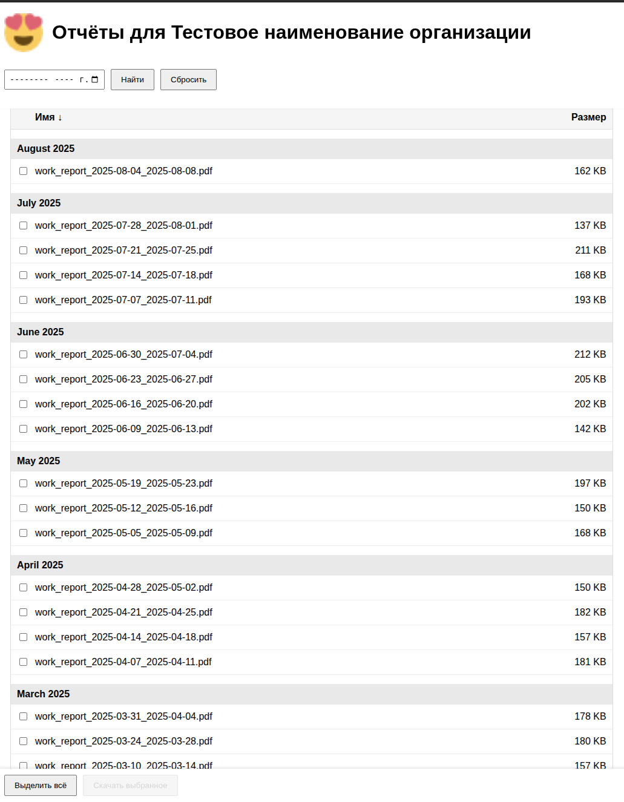
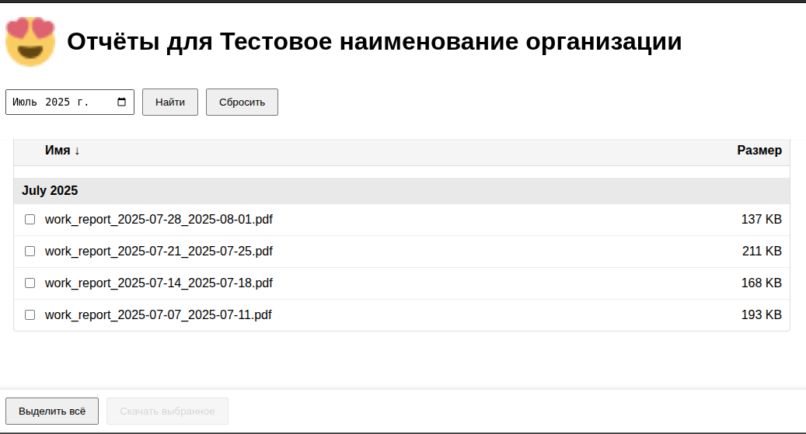
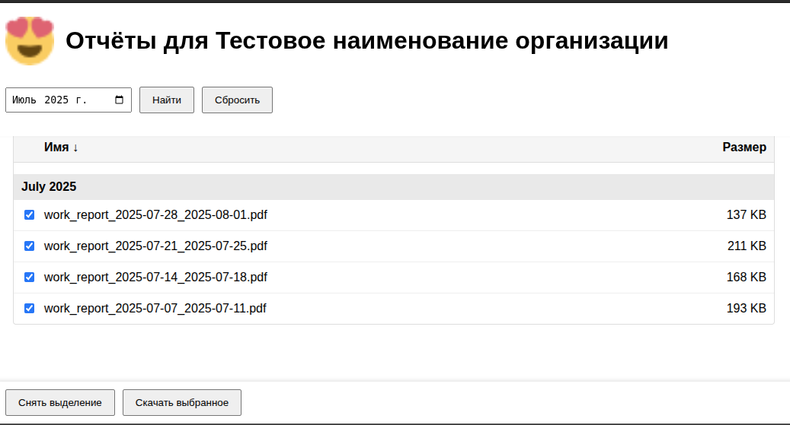

# PHP Secure Report Viewer

[EN](README.MD) | RU

## 📋 Назначение

Данный скрипт представляет собой простое веб-приложение на PHP для **защищённого доступа к файлам на примере PDF**.  
Функционал включает:
- Авторизацию по секретному ключу
- Проверку геолокации клиента и ограничение доступа по стране
- Логирование и отправка на email всех попыток входа с информацией о клиенте (IP, город, провайдер, User-Agent)
- Отображение списка файлов с возможностью фильтрации по месяцу
- Скачивание одного или нескольких файлов (ZIP-архив при множественном выборе)
- Простое оформление и возможность загрузки логотипа организации

---

## 🖥 Минимальные системные требования

- **PHP**: версии 7.4 и выше (рекомендуется 8.0+)
- **Расширения PHP**:
  - `zip` (для упаковки нескольких файлов в архив)
  - `openssl` (рекомендуется для работы с HTTPS)
- **Веб-сервер**: Apache / Nginx
- Доступ к интернету для сервиса `ip-api.com` (для определения геолокации)
- Права на запись в директории:
  - `reports/`
  - `temp/`

---

## ⚙ Установка

1. Склонируйте репозиторий в директорию веб-сервера:
   ```bash
   git clone https://github.com/<your-username>/php-secure-report-viewer.git
   ```
2. Перейдите в папку проекта:
   ```bash
   cd php-secure-report-viewer
   ```
3. Создайте необходимые директории:
   ```bash
   mkdir reports temp
   chmod 755 reports temp
   ```
4. Убедитесь, что веб-сервер имеет права на запись в эти папки.

---

## 🔧 Настройка

1. Откройте файл `index.php` в любом текстовом редакторе.
2. Укажите свои секретные ключи в массиве `$SECRET_KEYS`:
   ```php
   $SECRET_KEYS = [
       '123345' => [
           'code' => 'test',      // код организации (папка с отчётами)
           'name' => 'Display name' // отображаемое имя
       ],
   ];
   ```
3. Настройте директории:
   ```php
   $BASE_DIR = __DIR__ . '/reports/';
   $TEMP_DIR = __DIR__ . '/temp/';
   ```
4. Укажите email-адреса для уведомлений:
   ```php
   mail("receiver@example.com", ...);
   ```
5. Для каждого клиента создайте отдельную подпапку в `reports/`:
   ```
   reports/
   └── test/
       ├── logo.png
       ├── work_report_2025-07-07_2025-07-11.pdf
       └── work_report_2025-07-14_2025-07-18.pdf
   ```

---

## 🖼 Скриншоты

**Главная страница со списком файлов:**



**Фильтрация по месяцу:**



**Выбор и скачивание файлов:**



---

## 📜 Лицензия
Проект распространяется под лицензией MIT. Вы можете свободно использовать, модифицировать и распространять скрипт, сохраняя авторские права.
